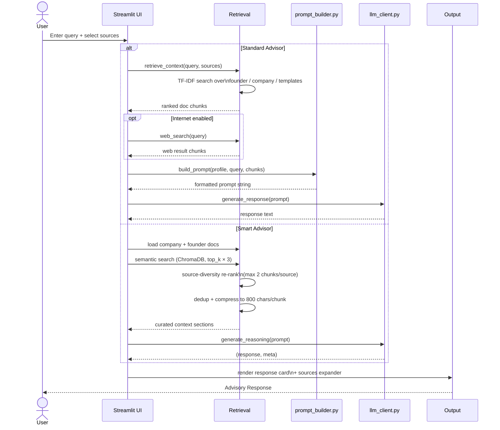
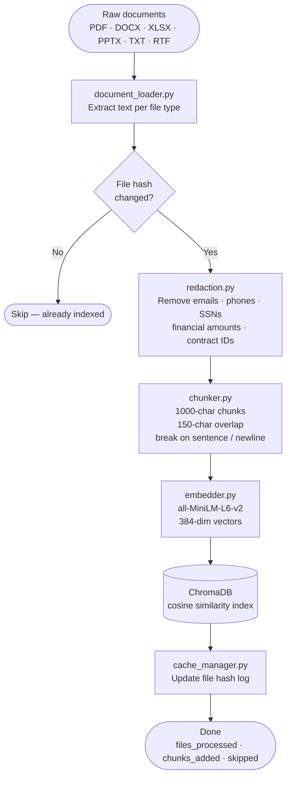
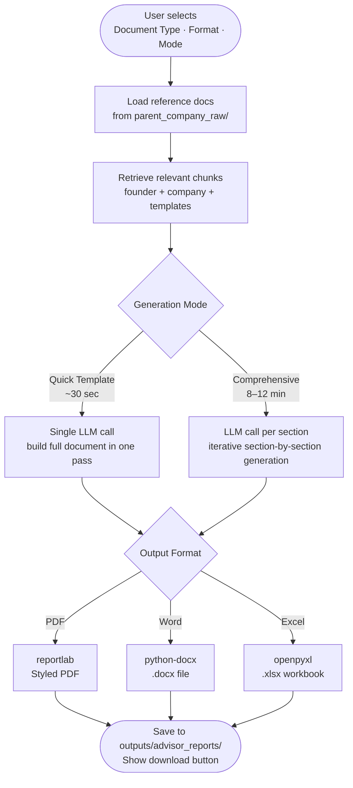

# Venture Studio AI Advisor

An AI-powered advisory platform for early-stage medical device and biotech startups. It combines semantic document retrieval, PII redaction, and multi-LLM support to deliver grounded regulatory guidance and auto-generated compliance documents — all running locally by default.

---

## Table of Contents

- [Overview](#overview)
- [Architecture](#architecture)
- [Data Flow](#data-flow)
- [Indexing Pipeline](#indexing-pipeline)
- [Document Generation Flow](#document-generation-flow)
- [Setup](#setup)
- [Configuration](#configuration)
- [Project Structure](#project-structure)
- [Document Types](#document-types)

---

## Overview

| Feature | Detail |
|---|---|
| UI | Streamlit (3 tabs) |
| LLM backends | Qwen 2.5 / 3.5 (local via Ollama), Claude Sonnet, GPT-4o |
| Retrieval | ChromaDB semantic search + TF-IDF fallback |
| Embedding model | `all-MiniLM-L6-v2` (384-dim, runs locally) |
| Privacy | PII redacted before indexing; local-first by default |
| Output formats | PDF, Word (.docx), Excel (.xlsx) |
| Input formats | PDF, DOCX, XLSX, CSV, PPTX, TXT, MD, RTF |

---

## Architecture

High-level component map — how the UI, retrieval layer, LLM backends, and storage fit together.

```mermaid
graph TB
    subgraph UI["Streamlit UI (app.py)"]
        T1[Standard Advisor]
        T2[Smart Advisor]
        T3[Generate Documents]
        SB[Sidebar\nCompany Profile · Knowledge Sources · Model Settings]
    end

    subgraph Retrieval["Retrieval Layer"]
        R1[retrieval.py\nTF-IDF search]
        R2[smart_advisor.py\nSemantic search + re-rank]
        VS[(ChromaDB\nvector store)]
        TFIDF[(TF-IDF\nfallback store)]
        WS[web_search.py\nDuckDuckGo]
    end

    subgraph Indexing["Indexing Pipeline"]
        DL[document_loader.py\nPDF · DOCX · XLSX · PPTX · RTF]
        RED[redaction.py\nPII removal]
        CHK[chunker.py\n1000-char chunks]
        EMB[embedder.py\nall-MiniLM-L6-v2]
        FI[fast_indexer.py\nhash-cached orchestrator]
    end

    subgraph LLM["LLM Backends (llm_client.py)"]
        Q[Qwen 2.5 / 3.5\nOllama · local]
        C[Claude Sonnet\nAnthropic API]
        O[GPT-4o\nOpenAI API]
    end

    subgraph Generation["Document Generation"]
        PG[pdf_generator.py]
        PDF[PDF\nreportlab]
        DOCX[Word\npython-docx]
        XLSX[Excel\nopenpyxl]
    end

    subgraph Data["Data Directories"]
        FS[founder_startup/]
        CO[companies/{name}/]
        ST[shared_templates/]
        PC[parent_company_raw/]
    end

    SB -->|profile + toggles| T1 & T2 & T3
    T1 --> R1
    T2 --> R2
    T3 --> PG

    R1 --> TFIDF
    R2 --> VS
    R1 & R2 --> WS

    FI --> DL --> RED --> CHK --> EMB --> VS
    Data --> DL

    T1 & T2 --> Q & C & O
    T3 --> PG
    PG --> PDF & DOCX & XLSX
    PC --> PG
```

---

## Data Flow

How a user query travels from the UI through retrieval, prompt construction, and the LLM back to the screen — for both advisor tabs.



---

## Indexing Pipeline

How raw documents are processed into the searchable vector store. Run via the **Index Management** sidebar panel or `fast_indexer.index_folder()` directly.



---

## Document Generation Flow

How the **Generate Documents** tab produces a regulatory document from parent-company knowledge.



---

## Setup

### Prerequisites

- Python 3.10+
- [Ollama](https://ollama.ai) (for local Qwen models)

### 1 — Install dependencies

```bash
cd VENTURE_VER1/venture_studio_ai
pip install -r requirements.txt
```

### 2 — Pull local models (optional but recommended)

```bash
ollama pull qwen2.5:3b
ollama pull qwen3.5:latest
```

### 3 — Configure API keys (optional)

Create a `.env` file in `venture_studio_ai/`:

```env
ANTHROPIC_API_KEY=sk-ant-...
OPENAI_API_KEY=sk-...
```

### 4 — Add your documents

Place documents in the appropriate data directories:

| Directory | Purpose |
|---|---|
| `data/founder_startup/` | Founder background and prior experience |
| `data/companies/{name}/` | Company-specific documents |
| `data/shared_templates/` | Generic SOPs and templates |
| `data/parent_company_raw/` | Reference knowledge base for document generation |

### 5 — Index documents

```bash
streamlit run app.py
```

Then open the **Knowledge & Documents → Index Management** panel in the sidebar and click **Rebuild Search Index**.

### 6 — Run

```bash
streamlit run app.py
```

---

## Configuration

Key settings in `config.py`:

| Setting | Default | Description |
|---|---|---|
| `MODEL_FAST` | `qwen2.5:3b` | Fast model for quick responses |
| `MODEL_REASONING` | `qwen3.5:latest` | Full reasoning model |
| `CLAUDE_MODEL` | `claude-sonnet-4-6` | Claude backend model |
| `OPENAI_MODEL` | `gpt-4o` | OpenAI backend model |
| `OLLAMA_URL` | `http://localhost:11434/api/generate` | Local Ollama endpoint |
| `MAX_INPUT_CHARS` | `8000` | Prompt truncation limit |
| `MAX_OUTPUT_TOKENS` | `800` | LLM max response length |
| `MAX_CHUNK_CHARS` | `800` | Context compression per chunk |
| `MAX_RETRIEVED_CHUNKS` | `3` | Standard advisor retrieval limit |
| `CHUNK_SIZE` | `1000` | Indexing chunk size (chars) |
| `CHUNK_OVERLAP` | `150` | Overlap between consecutive chunks |
| `SAVE_PROMPT_LOGS` | `True` | Save prompts to `outputs/prompt_logs/` |

---

## Project Structure

```
venture_studio_ai/
├── app.py                      # Streamlit entry point (3-tab UI)
├── config.py                   # All configuration and paths
├── requirements.txt
│
├── modules/
│   ├── advisor_engine.py       # Output formatter
│   ├── cache_manager.py        # File hash + query result caching
│   ├── chunker.py              # Text chunking
│   ├── context_compressor.py   # Token-limit compression
│   ├── document_loader.py      # Multi-format text extraction
│   ├── embedder.py             # Sentence-transformer embeddings
│   ├── fast_indexer.py         # Indexing orchestrator
│   ├── file_utils.py           # File I/O helpers
│   ├── llm_client.py           # Multi-backend LLM client
│   ├── pdf_generator.py        # Document generation (PDF/DOCX/XLSX)
│   ├── prompt_builder.py       # Prompt assembly
│   ├── redaction.py            # PII removal
│   ├── retrieval.py            # TF-IDF retrieval
│   ├── smart_advisor.py        # Semantic search + re-ranking pipeline
│   ├── vector_store.py         # ChromaDB + TF-IDF store wrappers
│   └── web_search.py           # DuckDuckGo integration
│
├── prompts/
│   ├── base.py                 # System prompt + output format template
│   ├── architect.py            # Architecture guidance prompt
│   ├── coder.py                # Code generation prompt
│   └── reviewer.py             # Code review prompt
│
├── services/
│   └── prompt_service.py       # Prompt type dispatcher
│
├── assets/
│   └── venture_logo.png        # Top nav logo
│
├── .streamlit/
│   └── config.toml             # Streamlit theme
│
└── outputs/
    ├── advisor_reports/        # Generated documents (PDF, DOCX, XLSX)
    ├── generalized_templates/  # Exported templates
    └── prompt_logs/            # Audit trail of sent prompts
```

---

## Document Types

The **Generate Documents** tab can produce 20+ regulatory and operational documents:

| Category | Documents |
|---|---|
| Quality System | Quality Manual, Document & Change Control, Internal Audit Program |
| Risk & CAPA | Risk Management, Corrective & Preventive Action (CAPA), Nonconforming Materials |
| Design | Design and Development, Design Changes |
| Supply Chain | Purchasing Process, Vendor Management |
| Operations | Manufacturing Processes & Material Handling, Equipment Controls, Environmental Controls, Line Clearance, Gowning |
| Validation | Validation Procedure, Sterilization Process Monitoring |
| Post-Market | Customer Feedback & Complaint Handling, Medical Device Reporting, Corrections & Removals |
| HR | Training |
